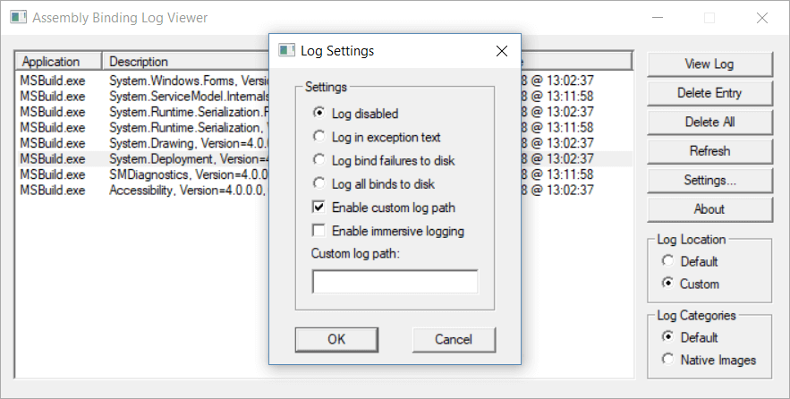
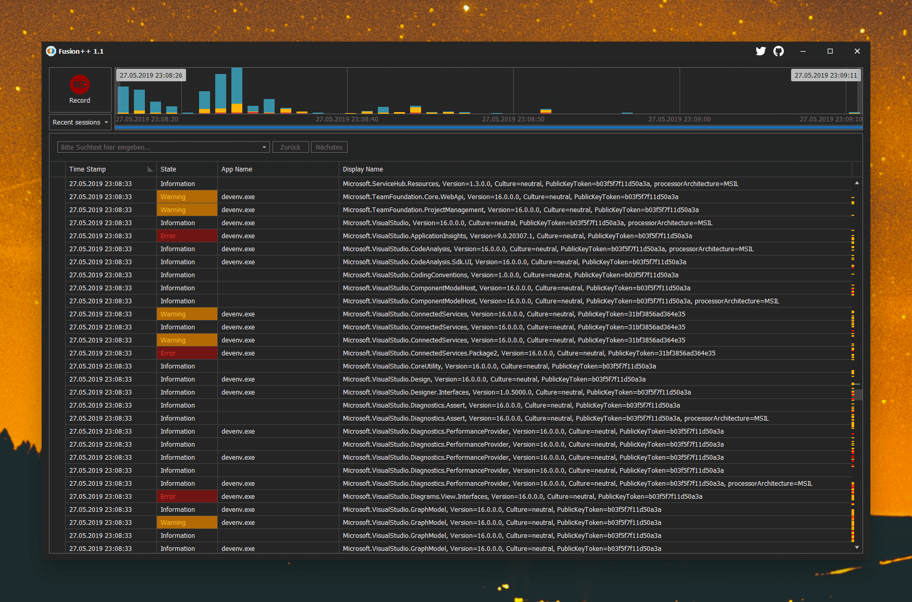

> Dev tools and great UX don’t have to be mutually exclusive
>
>

Did you ever have the pleasure to analyze assembly binding logs in .NET? You came here by yourself so I assume you know the good old FUSLOGVW.exe.

So, do you know what **"Enable immersive logging"** means? Or why you should separate log categories from **"Default" and "Native Images"**?
Did you ever **forget to disable the log again** and wondered why every .NET application was that slow and your disk ran out of space?

## Introducing Fusion++

### Forget all the setup upfront - just hit "Record" to capture your assembly logs. If you are done, click "Stop" again. That's it.

Fusion++ then parses all the log files for you. It will try to find warnings and errors and highlight the parsed records in the UI accordingly*. There's no need to go hunting in the file system anymore.

Fusion++ makes sure that all the assembly logs are routed to the Windows TEMP folder so that they can be cleaned up with the default Windows tools. On top of that it builds an intelligent session management so that you can separate recorded sessions from each other and check them again later.

📦  [Check the Releases page](https://github.com/awaescher/Fusion/releases) to **download** the latest version and see **what's new**!

🍫  Available on [chocolatey](https://chocolatey.org/packages/fusionplusplus) as well, just use `choco install fusionplusplus`.

 \* *Similar assembly bindings which happened at the same time (within 3 seconds tolerance) are automatically aggregated to keep the assembly list short.* 

### Maybe most important:

Fusion++ uses the same settings as the "Assembly Binding Log Viewer", so it uses the built-in .NET log functionality. It will back up your "Assembly Binding Log Viewer" settings as long as it is executed. As soon as you close it, it will re-apply them to make the application as transparent as possible. 
But as long you are executing Fusion++, it automatically takes care of all the stuff for you. No radio buttons, no custom log paths, no files you have to go through.

## Building
Note that you need to have a valid [DevExpress WinForms subscription](https://www.devexpress.com/products/net/controls/winforms/) to build Fusion++ by yourself.
If you do not have a subscription, you are limited to use the precompiled versions from the releases tab.

We're talking about licensing, so I won't give any support to bypass this - please don't open issues about it.

## Credits
The app icon was made by <a href="https://www.flaticon.com/authors/roundicons" title="Roundicons">Roundicons</a> from <a href="https://www.flaticon.com/" title="Flaticon">www.flaticon.com</a> and is licensed by <a href="http://creativecommons.org/licenses/by/3.0/" title="Creative Commons BY 3.0" target="_blank">CC 3.0 BY</a>
